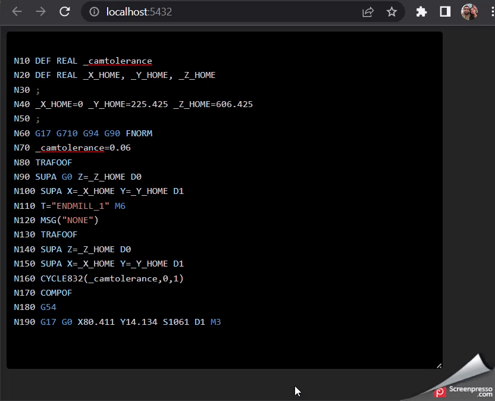

### Create React vite project with typescript support
```
npm init vite@latest gcode-editor -- --template react-ts
```

### Install bootstrap
```
npm i --save bootstrap @popperjs/core
```

### Install sass
```
npm i --save-dev sass
```

### Initialize Project
```
npm i
vite
```

### Demo nc-editor


